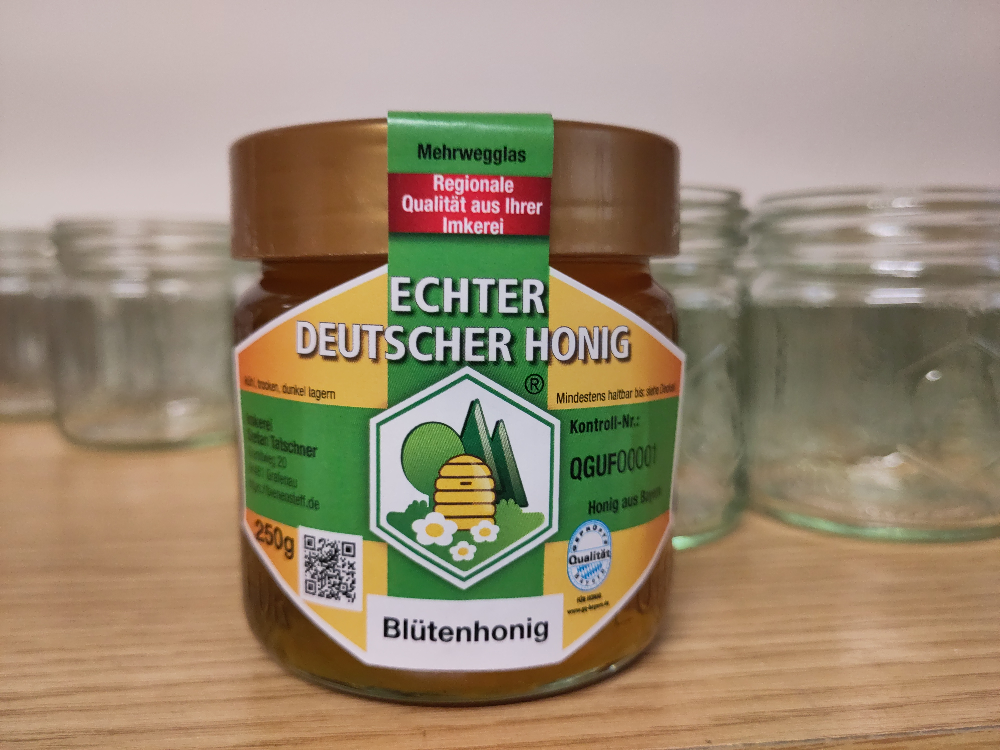


## Bayerische Honigprämierung 2024 {.card-title .h5}

Unser Honig hat 2024 bei der Bayerischen Honigprämierung eine [Goldmedaille](/auszeichnungen/2024-11-03-honigpraemierung.pdf) erhalten – darüber gfrein wir uns natürlich narrisch.
Ein schöner Beleg für echte Qualität aus unserer kleinen Imkerei.
Seit 2025 sind wir zudem [Mitglied](/zertifikate/20250523-gq-zertifikat.pdf) im Programm Geprüfte Qualität — Bayern.
Honige aus unserer Imkerei, die den Qualitätsstandard Geprüfte Qualität — Bayern für Honig erfüllen, vertreiben wir unter der Marke [Echter Deutscher Honig®](https://deutscherimkerbund.de/warum-unser-honig/).


## Unsere Honige 2025

Was wir gerade im Angebot haben und was es kostet, steht in der [aktuellen Preisliste]().
Dieses Jahr war die Witterung sehr wechselhaft.
Unser diesjähriger **Blütenhonig** 🍯🌸 vereint das ganze Bienenjahr in sich – und schmeckt daher besonders aromatisch 🤤.
Probiert ihn einfach selbst!

Was aktuell im Angebot ist und welche Preise gelten, findet ihr in der [aktuellen Preisliste]().

    
    

**Neu in diesem Jahr**: Honig im kleineren Glas – perfekt als Geschenk! 🎁

Unsere Bienen stehen ganzjährig an festen Standorten im Münchner Grüngürtel.
Mehrmals im Jahr wird geerntet, schonend geschleudert und von Hand ins Glas gefüllt.
Alle Sorten stammen zu 100 % aus unserer eigenen Imkerei.
Die frische Ernte gibt es jedes Jahr ab September.
In unserer [Honigdatenbank]() lässt sich jede Losnummer bis zum Erntedatum zurückverfolgen.
Bei Fragen sprecht uns gerne an!

Wer tiefer eintauchen möchte 🎓:
Allgemeine Informationen rund um Honig gibt es auf der [Webseite](https://deutscherimkerbund.de/honig/) des Deutschen Imkerbundes.
Detailliertere Informationen findet ihr in den [Leitsätzen für Honig](https://www.bmel.de/SharedDocs/Downloads/DE/_Ernaehrung/Lebensmittel-Kennzeichnung/LeitsaetzeHonig.html) des Deutschen Lebensmittelbuchs oder in den [Honigsorten-Bezeichnungen](https://deutscherimkerbund.de/wp-content/uploads/2025/02/34-honigsorten-bezeichnungen-2021.pdf) vom Deutschen Imkerbund.

### Kristallisation 💡

*Echter Honig kristallisiert – ganz normal.*

Unser Honig kommt direkt aus unserer eigenen Imkerei und wird weder erhitzt noch gefiltert.
Je nach Blüten und Jahreszeit kann der Honig a bisserl anders schmecken oder ausschauen – so wie’s die Natur vorgibt.
Mit der Zeit wird er fester bzw. [kristallisiert](https://bienen.info/honig-kristallisiert-biologin-klaert-auf/) – des is a ganz natürlicher Vorgang und zeigt, dass er unbehandelt is.

Wenn du ihn wieder flüssig magst, einfach ins warme Wasserbad stellen (bitte ned über 40 Grad).

## Verkaufsstellen

Unser Honig kann an folgenden Stellen gekauft werden.
Beim Direktverkauf am besten vorher kurz anrufen oder schreiben.
Wir nehmen Honiggläser gerne gespült zurück – Etikett bitte, wenn möglich, entfernen.

| Verkaufsstelle  | Art  | Adresse | Kontakt |
|-----------------|------|---------| ------- |
| Haustür | Direktverkauf | [Stefan Tatschner Gräfelfinger Straße 169a 81375 München](https://maps.app.goo.gl/CxwePVnqYxZf5y3k8) | Mobil: <a href="tel:+4915124096409">+49 1512 4096409</a> E-Mail: info@bienensteff.de |
| Haustür | Direktverkauf | [Familie Tatschner Granitweg 20 94481 Grafenau](https://maps.app.goo.gl/jTKsPPaF4Zm2bUPV6) | Tel: <a href="tel:+4985523391">+49 8552 3391</a> E-Mail: anneliese.tatschner@gmail.com |
| [Honighäusl](http://honey.floriankreuzer.de/verkaufsstellen/) | SB-Verkauf | [Rambaldistr. 33 81929 München](https://maps.app.goo.gl/V2AfBJat9t6mBJ1J7) |[johannesbienen.muenchen](https://www.instagram.com/johannesbienen.muenchen/) |
{.table .table-striped .table-bordered}

## Preisliste

**Gültig ab 12.09.2025**

| Art.-Nr. | Produkt | Marke | <acronym title="Verkaufseinheit">VKE</acronym> | <acronym title="Verpackungseinheit">VPE</acronym> | Preis | Preis / kg |
|----------|-------------|----------------| -- | -- | -- | -- |
| <small>HDB250E</small> | Blütenhonig | Echter Deutscher Honig® | 250 g Glas | 1 | 5,00 € | 20,00 € |
| <small>HDB250K6</small> | Blütenhonig | Echter Deutscher Honig® | 250 g Glas | 6 | 25,00 € | 16,67 € |
| <small>HNB500E</small> | Blütenhonig | bienensteff (Hausmarke) | 500 g Glas | 1 | 9,00 € | 18,00 € |
| <small>HNB500K6</small> | Blütenhonig | bienensteff (Hausmarke) | 500 g Glas | 6 | 48,00 € | 16,00 € |
{.table .table-striped .table-bordered}

Wer gleich **sechs Gläser oder mehr** mitnimmt, zahlt a bissal weniger. 🙂
Auf Wunsch füllen wir den Honig auch in mitgebrachte Gläser oder auch Eimer ab.
Sonderabfüllungen bitte **bis Anfang September** anfragen – dann können wir’s passend einplanen.

Alle Preise sind Endverbraucherpreise (EVP) im Direktverkauf.
Die Abgabe erfolgt in haushaltsüblichen Mengen und nur solange der Vorrat reicht.
Wir sind nach §19 UStG als Kleinbetrieb umsatzsteuerbefreit – es wird keine Mehrwertsteuer ausgewiesen.
Durchgestrichene Sorten sind derzeit ausverkauft.
